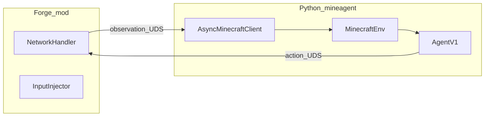

# MineAgent overview

## What this project is

MineAgent is a **research codebase** for *virtual intelligence*: AI that exists and acts **inside** a virtual world. Minecraft is the primary testbed because it is diverse and challenging while still being a tractable approximation of rich environments.

The project is **early-stage** (see `README.md`). The near-term research direction is **visual perception plus curiosity**, with the agent initially oriented toward **observation and head / attention control** (region-of-interest / camera-style movement) rather than full embodied locomotion mastery.

## Repository map

| Path | Role |
|------|------|
| `mineagent/` | Python package: Gymnasium env, RL agent, learning (PPO, ICM), monitoring, client |
| `forge/` | Minecraft **Forge** mod (Java): frames, rewards, input injection, Unix-socket servers |
| `config_templates/config.yaml` | Example YAML for `mineagent` CLI (`-f`) |
| `tests/` | Pytest suite mirroring package structure |
| `.github/workflows/` | CI: pytest (Pixi dev env), Gradle build, pre-commit |

Entrypoint for running the loop: **`mineagent.engine:run`** (invoked as `pixi run mineagent` or the `mineagent` CLI when the package is on `PATH`; task defined in `pixi.toml`).

## Runtime shape (one sentence)

Python **`MinecraftEnv`** talks to the Forge mod over **Unix domain sockets** (observations in, actions out); **`AgentV1`** turns frames into actions and learns with **PPO** plus an **intrinsic curiosity (ICM)** signal.

## Deeper skills (read as needed)

Skills live under **`.agents/skills/`** in this repo. Other tools (Cursor, Opencode, etc.) may need you to **register or symlink** that path if they only auto-discover a default skills directory—point them at these folders or copy the `SKILL.md` trees they expect.

| Skill | When to open it |
|-------|-----------------|
| `mineagent-python` | Changing agent, perception, learning, engine, or Gymnasium env |
| `mineagent-forge-mod` | Changing the Java mod, Gradle, MC/Forge versions |
| `mineagent-ipc` | Changing sockets, wire formats, or Python/Java protocol parity |
| `mineagent-dev-workflow` | Pixi, pytest, pre-commit, CI |

## External references (human)

- Issue tracker and contribution notes: see `README.md` (GitHub project name may differ from local folder name).
